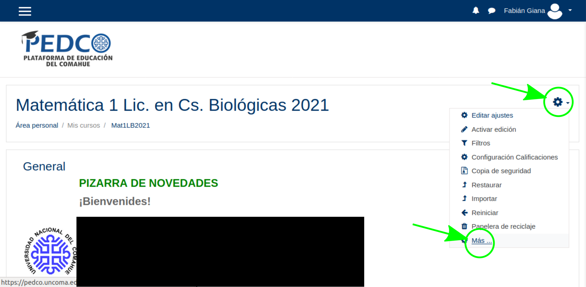
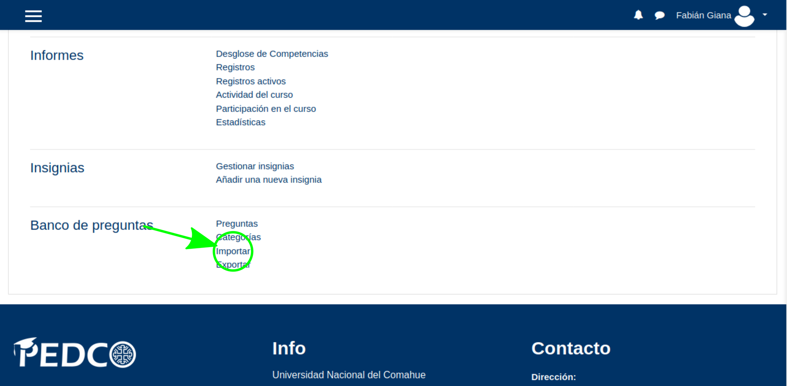
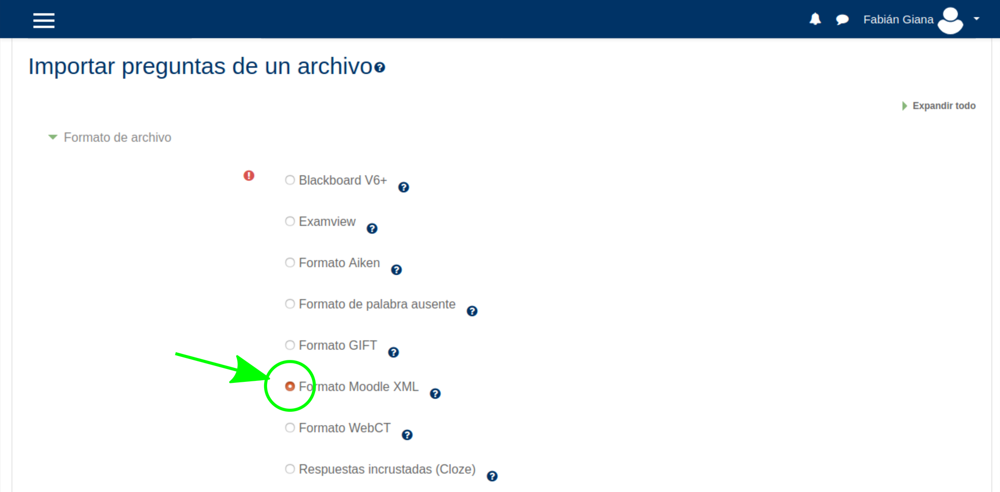
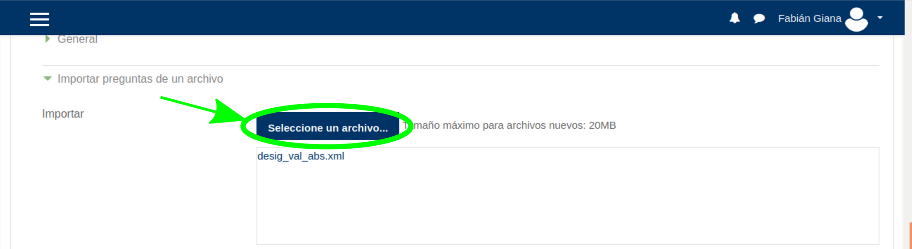
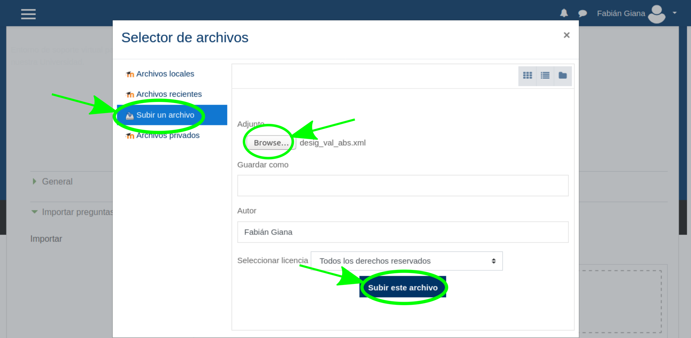
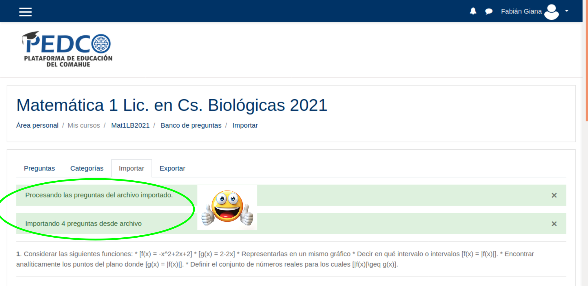

# latex2xml

El objetivo de este _software_ es convertir un archivo de LaTeX que contiene preguntas de una misma categoría en un archivo Moodle-XML, para poder importar todas las preguntas de forma eficiente al Banco de Preguntas de Moodle. Es compatible con cualquier plataforma basada en Moodle, como por ejemplo PEDCO.  
Los archivos de salida pueden ser editados para agregar opciones adicionales. Por defecto, este software genera preguntas de tipo "ensayo" (essay) con un cuadro de texto (opcional) de 15 líneas y permite adjuntar archivos de imagen y documentos tipo "word", "excel", etc. Los nombres de las preguntas se colocan automáticamente, con el formato *category_x*, donde _category_ es el nombre de la categoría y _x_ es la posición de la pregunta en el documento (empieza en 0).  
Para ejecutarlo, es necesario tener instalado _Jupyter Notebook_ o _Jupyter Lab_ con _python3_. Una alternativa es ejecutar el código desde [Google Colab](https://colab.research.google.com/).

## ¿Cómo se usa?
(Cualquier duda, escribir a fabiangiana@gmail.com)

Lo más fácil es clonar este repositorio usando _git_. Si no sabés cómo hacerlo, podés descargar los archivos _LaTeX_2_xml.ipynb_ y _latex2xml.py_ y colocarlos en una misma carpeta en tu PC (cualquier carpeta funcionará). Luego, tenés que correr un _server_ de Jupyter Notebook (o Jupyter Lab) desde ese directorio, abrir la _notebook_ (el archivo con extensión .ipynb), configurar y ejecutar las celdas siguiendo las instrucciones.  

### Configuración

#### Un solo archivo
El código que hace todo el trabajo se resume en dos líneas:
```
import latex2xml as l2x # Paquete para convertir a XML
l2x.generate_xml_q(filename,latex_dir = 'questions_latex',xml_dir = 'questions_xml',q_type = 'essay',q_format = 'html',q_category = {}) # Convierto el archivo a XML de Moodle 
```
La segunda línea ejecuta el método `generate_xml_q`, que tiene los siguientes argumentos:

`filename` - tipo _string_: es el nombre del archivo, que debe estar contenido en el directorio `latex_dir`.  
`latex_dir` - tipo _string_: es el directorio donde está el archivo _.tex_ que se desea convertir. Tiene que ser un subdirectorio del directorio donde está el _notebook_. Por defecto es `'questions_latex'`.  
`xml_dir` - tipo _string_: es el directorio donde se guardará el archivo _.xml_ resultante de la conversión, y es un subdirectorio del directorio donde está el _notebook_. Por defecto es `'questions_xml'`.  
`q_type` - tipo _string_: es el tipo de pregunta de Moodle. Por defecto es `'essay'`, y todavía no se admiten otros tipos (está pensado para el futuro).  
`q_format` - tipo _string_: es el formato del texto de la pregunta. Por defecto es `'html'`, y todavía no se admiten otros tipos (está pensado para el futuro).  
`q_category` - tipo _string_: es el nombre de la categoría donde se colocará la pregunta dentro del Banco de Preguntas. Por defecto es igual al nombre del archivo _.tex_, sin la extensión.  

Todos los argumentos, excepto `filename`, son opcionales (si no se los utiliza al llamar la función, se les asigna el valor por defecto).  
Por ejemplo, si el archivo que se desea convertir está ubicado en `C:/Documentos/my_folder/preguntas_latex/matrices.tex` y se desea usar el nombre del archivo como nombre de la categoría, entonces el _notebook_ debe estar ubicado en `C:/Documentos/my_folder/` y se debe llamar la función de la siguiente manera:

```l2x.generate_xml_q('matrices.tex',latex_dir = 'preguntas_latex')```

#### Todos los archivos en un directorio
Si se utiliza esta opción, el método que hace el trabajo se llama de la siguiente forma:

```generate_xml_q_folder(foldername,xml_dir = 'questions_xml')```

Acá, `foldername` es el nombre del directorio que contiene los archivos _.tex_ a convertir, y el argumento opcional `xml_dir` tiene el mismo significado y valor por defecto que en el caso de la conversión de un solo archivo. Todos los demás argumentos que se usan en la conversión de un solo archivo toman sus valores por defecto en este caso (en particular, el nombre de la categoría coincide en cada caso con el nombre del archivo).

### Formato del archivo de entrada

El archivo de entrada tiene que ser un documento de LaTeX con extensión _.tex_ que compile bien. Todavía no se soportan imágenes. La estructura del documento debe ser similar a la siguiente (hay 3 preguntas):

---------------------------------------------
    ...

    \begin{document}  
    \begin{enumerate}

    \item
    %q
    ...
    ...

    \item
    %q
    ...
    ...

    \item
    %q
    ...
    ...
    %q
    \end{enumerate}  
    \end{document}

---------------------------------------------

La parte previa a _\begin{document}_ es el preámbulo, y es irrelevante.  El bloque _enumerate_ engloba todas las preguntas. Cada pregunta inicia con un _\item_ seguido inmediatamente por un comentario _%q_ en la siguiente línea. Además, debe haber un comentario _%q_ al final de la última pregunta (justo antes del _\end{enumerate}_). Si se respeta este formato, aunque el archivo de salida sea único, Moodle identificará todas las preguntas de forma individual.  

### Bloques permitidos

Hasta el momento, sólo se permite el uso de bloques de tipo _enumerate_ (lista numerada), _itemize_ (lista con viñetas) y _equation_ (ecuación). Estas funcionalidades deben ser utilizadas en su mínima expresión, sin opciones especiales de formato.  

Todos estos bloques tienen que estar escritos de manera prolija, de la forma siguiente (el ejemplo es un bloque _enumerate_):

-----------------------------------------------

    \begin{enumerate}
    \item ...
    ...
    
    \end{enumerate}
-----------------------------------------------

Es **muy importante** que los comandos _\begin\{X\}_ y _\end{X}_ estén bien escritos, sin espacios en blanco entre los caracteres. Pueden anidarse bloques, por ejemplo _enumerate_ dentro de _enumerate_, _itemize_ dentro de _enumerate_, etc.  

### Formato de texto permitido

Hasta el momento, se admite texto en cursiva (_\textit{...}_) y negrita (_\textbf{...}_). No obstante, todavía no se pueden anidar estos comandos de formato.  

### Símbolos especiales

Hasta ahora, sólo se ha resuelto el uso del "símbolo peso", que se escapa como _\\$_ dentro de una ecuación.

## ¿Cómo se suben las preguntas a PEDCO? (es similar para otras plataformas que usen Moodle)

1. En la página principal del curso, hacer click en la rueda "menú de acciones" y seleccionar "Más...".



2. En la sección "Banco de preguntas", hacer click en "Importar".



3. En la sección "Formato de archivo", seleccionar "Formato Moodle XML".



4. Más abajo, en la sección "Importar preguntas de un archivo", hacer click en "Seleccione un archivo...".



5. Se abrirá la ventana del "Selector de archivos". Hacer click en "Subir archivo", luego "Browse" y seleccionar el archivo que se desee. Luego, hacer click en "Subir este archivo".



6. Finalmente, hacer click en "Importar". Se recibirá un mensaje indicando el éxito o fracaso de la operación de importación.


